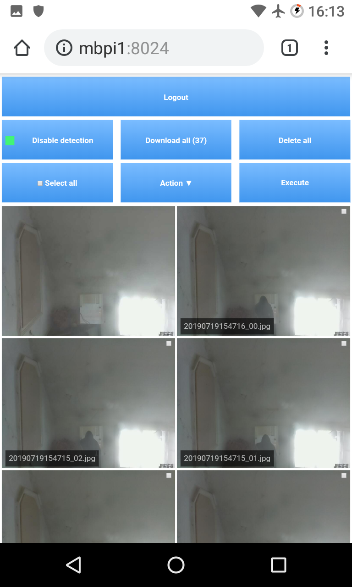
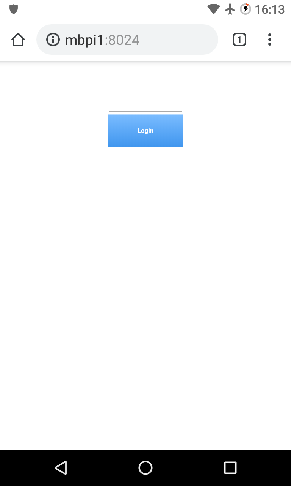

# motion cam viewer

lightweight web-based motion security cam viewer frontend with image management and detection control.
Camera trap with less administration effort optimized for pragmatic home surveillance and mobile use made for Debian based security webcams.

Buzzwords: security cam application, webcam viewer, camera trap, motion, node.js, express

[https://github.com/loadenmb/motion_cam_viewer](https://github.com/loadenmb/motion_cam_viewer)

## Features
- lightweight: 
    - live stream view + image overview & detail view
    - snapshot + motion detection control
    - image management: download / delete selected images
- secure: 
    - brute force protected login
    - ddos protected application
    - SSL support
    - runs with less privilegs / permissions
    - optional: authenticated tor hidden service setup (free dyn DNS / encryption + meta data protection)
- optimized: for less administration effort & for mobile use / low bandwith, ships with predefined motion detection configuration
- integrated: systemd autostart and installer for Raspbian / Debian available
- easy to extend: node.js, express with ejs templates, plain slim HTML / JS frontend (no jQuery, no Bootstrap), motion based camera setup

## Screenshots
 

## Setup
For Debian based systems. Tested on Debian / Raspbian.

### Prequesists / depencies
- setup camera which supported by [motion](https://motion-project.github.io/)
- [setup newer node.js version](https://github.com/nodesource/distributions) 
```shell
# ...be root...

# install depencies
apt-get install -y motion nodejs
```
### Prequesists / depencies on Raspberry PI ARMv6
- setup camera which supported by [motion](https://motion-project.github.io/)
- [install newer node.js from pre build binary](https://nodejs.org/en/download/)
```shell
# get binaries local OR download direct at yourpi
wget https://nodejs.org/dist/v10.16.0/node-v10.16.0-linux-armv6l.tar.xz

# skip this step if you download node.js archive direct at your Raspberry PI
# upload binaries to your pi, login, get root
scp -P 21 -r node-v10.16.0-linux-armv6l.tar.xz pi@yourpi:/home/pi/
ssh pi@yourpi
su

# extract files, remove unused files, copy directory structure in /usr/local (you can do this more elegant)
cd /home/pi/
tar xf node-v10.16.0-linux-armv6l.tar.xz
cd node-v10.16.0-linux-armv6l
rm LICENSE README.md CHANGELOG.md
cp -r * /usr/local/ 
cd .. && rm -r node-v10.16.0-linux-armv6l

# install motion
apt-get install -y motion

```
OR build newer node.js from source (no deb repo for ARMv6 available, you need to setup the whole PI toolchain + cross compile because of the PI speed) 


### Motion cam viewer installation
```shell
# ...be root...

# get motion cam viewer from git
cd /usr/local/src/
git clone https://github.com/loadenmb/motion_cam_viewer/

# run setup from folder, keep care: you need to set options in assistent! :P
cd motion_cam_viewer/
chmod +x setup.sh
./setup.sh
```
Keep in mind thats it is required to run setup script after each major cam viewer upgrade at the moment.

See installer output for configured interfaces / ports.

By default try to connect via HTTP on your configured IP address (try lan ip if you don't know) on port 8024.

If it doesn't work (or you don't remember IP / port ;): 
- motion cam viewer log file is: */var/log/motioncamviewer.log*
- Also check output of:
```shell
systemctl status motioncamviewer
```

## Usage

Open *https://YOUR.LAN.IP:8024* in your web browser and login if default IP / port are configured at motion cam viewer. There's no futher explanation required.

**NOTICE**

For tor hidden service mode (access via .onion):
- authenticated tor hidden service setup can be used as free (dynamic) DNS / SSL replacement with additional connection meta data protection
- by default live stream is disabled because of connection speed and a snapshot is made and replaced for stream view if openend trough hidden service

## Extended usage

### Start / restart / stop service
```shell
systemctl (start|restart|stop) motioncamviewer
```

### Enable / disable start at boot
```shell
systemctl (enable|disable) motioncamviewer
```

### Change password
```shell
# become root

# go to installation dir
cd /usr/local/src/motion_cam_viewer/

# random password
./set_password.js

# custom password
./set_password.js "ABCDEFGHIJKLMNOPQRSTUVWXYZabcdefghijklmnopqrstuvwxyz0123456789#?!@$%^&*-"
```

### Change SSL certificate
```shell
# ...be root..., go to dir
cd /usr/local/src/motion_cam_viewer/

# generate new strong certificate, 10 years valid (-days 3650) 
openssl req -x509 -newkey rsa:4096 -keyout key.pem -out cert.pem -days 3650

# set certificate and private key in motion cam viewer config
# Alternative: skip this step, use nano text editor to add ssl_privateKeyPath, ssl_certificatePath in config
sed -i "s|\"ssl_privateKeyPath\": \".*\"|\"ssl_privateKeyPath\": \"/usr/local/src/motion_cam_viewer/key.pem\"|" "./config.json"
sed -i "s|\"ssl_certificatePath\": \".*\"|\"ssl_certificatePath\": \"/usr/local/src/motion_cam_viewer/cert.pem\"|" "./config.json"
```
### Change detection settings
No app related interface for detection setting changes is available at the moment. 

The quickest way is by direct change of these values at [motion configuration](https://motion-project.github.io/motion_config.html) file */etc/motion/motion.conf*: 
- threshold
- noise_level
- lightswitch
- mask_file

### Enable live stream for hidden service (not recommended)
Change *torHiddenService_snapshot* option in *config.json* to false
```shell
# ...be root..., go to dir
cd /usr/local/src/motion_cam_viewer/

# use live stream for hidden service
sed -i "s|\"torHiddenService_snapshot\": .*|\"torHiddenService_snapshot\": false|" "./config.json"
```
This is not recommended. Will not work proper caused of tor network speed most times.

## Roadmap / TODO / ideas (feel free to work on)
- maybe add sorted file cache for image manager, add max images read from dir (feel little slow down with many images > 10 000 detected) see: ./models/imageManager.js
- secret + hash based login (for login with "mobile alert" app on click without typing creditals)
- TCP server to hold persistent HTTP? connection and send "movement" notification of cam to mobile phone which has "mobile alert" app installed
- multi camera support over network (manage all cams from single client or each single client)
- add auto delete old images after time
- check how its possible to put camera on / off not only detection via motion
- add possibility to manage videos, record videos (just add file type :P) + motion config to record videos on detection (image capture at the moment only)
- add device shutdown option (this will require shutdown permission which must be set on installation)
- add camera detection, camera on / off scheduler (use own scheduler, cron require more permissions)
- add desktop css layout
- add more paranoid security: use motion MD5 based login for localhost connections
- show thumbnails on overview page / resize images on creation to save bandwith
- maybe add optional general / full motion configuration user interface support (check required permissions / webcontrol)
- create npm package?
- add log viewer for web interface
- multi language support (choose a great node.js multi language lib)

## Contribute

Discuss features, report issues, questions -> [here](https://github.com/loadenmb/motion_cam_viewer/issues).

Developer -> fork & pull ;)

## Related
- [motioneye:](https://github.com/ccrisan/motioneye/) which ships with his own Linux [motioneyeos](https://github.com/ccrisan/motioneyeos) mature large Python based motion webinterface with many configuration options
- [RPi Cam_Web Interface:](https://elinux.org/RPi-Cam-Web-Interface) similiar webserver + PHP based motion webinterface with many configuration options which require more system privilegs


